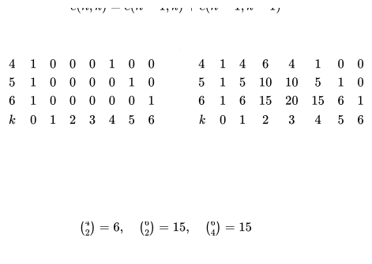

# Dynamic Programming

## [LeetCode Problems](./leetcode/)

## History

- Richard Bellman 1950s
- Not actually dynamic, programming meant something else then
- Recursion without repitition

## Counting Problems

### Counting Subsets of Size k

- calculates moving down and right in a 2d matrix



```text
def c(n,k):
   if k==0 or k==n: return 1
   table = a 2d array of size (n+1)*(k+1)
   for row in [0, n]:
      table[row][0] = 1
   for col in [0, k]:
      table[col][col] = 1
   for row in [2, n]:
      for col in [1, min(row, k)]:
         up=table[row-1][col]
         upleft=table[row-1][col-1]
         table[row][col] = up+upleft
   return table[n][k]
```

- T(n) = O(nk)
- Can optimize space complexity by only using current row and previous row

## Optimization Problems

- Maximize/minimize

### Maximum Path Sum

- Highest value path

```text
1 3 1
1 5 1
4 2 1
```

- Find highest point to reach bottom right
- Optimal substructure: Every optimal path continues
  - S &rarr; O &rarr; O &rarr; e

1. Initialize by getting sums for row 0 and col 0 (no need for auxilliary space)

   ```text
   1  4  5
   2  5  1
   6  2  1
   ```

2. Add grid values + maximum of left and right

   ```text
   1  4  5
   2  9  10
   6  11 12
   ```

3. Run from end to start following optimal substructures

   ```text
   (3,3):12 -> (2,1):11 -> (1,1):9 -> (0,1):4 -> (0,0):1
   ```

4. Reverse the indices

   ```text
   (0,0) -> (0,1) -> (1,1) -> (2,1) -> (3,3)
   ```

- No optimized solution for this since we need to return path

```text
def maxpath(grid):
   for j in 1 to n-1:
      grid[0][j] = grid[0][j-1]+grid[0][j]
   for i in 1 to m-1:
      grid[i][0] = grid[i-1]+grid[i][0]
   for row in 1 to m-1:
      for col in 1 to n-1:
         grid[row][col] += max(left, up)
   i,j=m-1,n-1
   path = []
   while i>0 or j>0:
      path.append((i,j))
      if up>left:
         i-=1
      else:
         j-=1
   path.reverse()
   return path
```

### Coin Change

- Return fewest number of coins to make an amount
- Minimization/optimization problem &rarr; dynamic programming

  - Greedy strategy will not work for example

  ```text
  options = [1,5,7], target = 10
  Greedy picks 7+1+1+1 and it should be 5+5
  ```

- Correct Solution with Dynamic Programming

1. Optimization Problem

2. Come up with a recurrence equation (hardest part)

   ```text
   c1+c2+c3+...+ck = a
   f(a) = fewest # coins to construct amount a.
   coins = [c1, c2, c3, ..., ck]
   f(a-c1)
   f(a-c2)
   ...
   f(a-ck)

   f(a) = min(f(a-ck))+1
   ```

   - determine **last** coin that would lead to amount a

3. Identify all the subproblems

   - a+1 distinct subproblems

4. Identify depencies
   - Each subproblem &rarr; vertex

5. Identify the data structure (usually a table)

6. Write up the DP algorithm

    ```text
    def coinchange(a, coins):
        table = 1d array of size (a+1)5_dynamic_programming
        # Base case
        table[0] = 0
        Initialize rest of the table to INF
        for i in 1 to a:
            # Compute and cache f(i)
            for c in coins:
                if i-c >= 0:
                    table[i] = min(table[i], table[i-c])
            table[i]++
        return table[a]
    ```

- T(a,k) = O(ak)
- S(a,k) = O(a)
