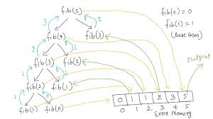
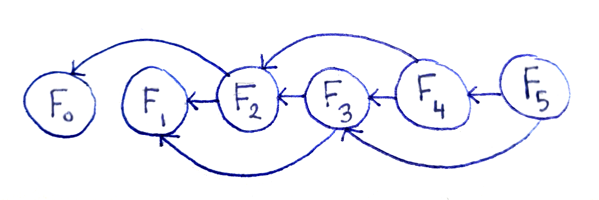

# Dynamic Programming

## [LeetCode Problems](./leetcode/)

## History

- Richard Bellman 1950s
- Not actually dynamic, programming meant something else then
- Recursion without repitition

## Top Down Memoization



- Use a hashmap to store values during recursion to prevent repetitions
- Just use stored result when calling recursion with the same values
- Typically store into variable named `memorandum/memo`
- Fib example

```text
def fib(n):
    if n in memo:
        return memo[n]
    if n==0 or n==1: return n
    else:
        memo[n]=fib(n-1)+fib(n-2)
        return memo[n]
```

- Less time, more space

## Bottom Up Tabulation

- Recursion tree turns into a dependency graph
  
- Directed acyclic graph (DAG)
  - Topological Sort
  - Calculate values of f in top sort order
- Fib example

```text
def fib(n):
    table = new array of size n+1
    table[0] = 0
    table[1] = 1
    for i in range [2,n]:
        table[i] = table[i-1]+table[i-2]
    return table[n]
```

- Time complexity: O(n)
- Space Complexity: O(n)
  - Can improve to O(1) since you only need previous 2 and current

```text
def fib(n):
    table = new array of size 3
    table[0] = 0
    table[1] = 1
    for i in range [2,n]:
        table[i%3] = table[(i-1)%3]+table[(i-2)%3]
    return table[n%3]
```

## Climbing n Stairs

- Counting problem &rarr; Recurrence equation &rarr; Bottom-up implementation
- Max steps at a time is 2. How many ways to climb the stairs?
