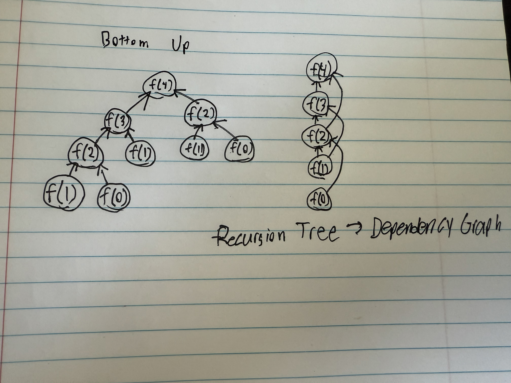
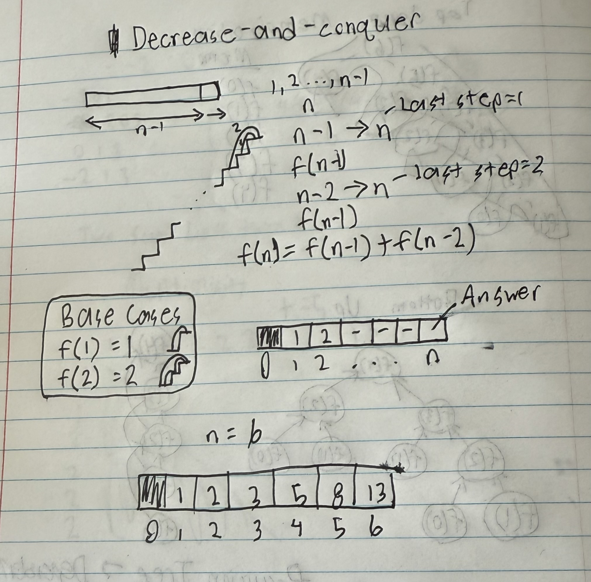

# Dynamic Programming

## [LeetCode Problems](./leetcode/)

## History

- Richard Bellman 1950s
- Not actually dynamic, programming meant something else then
- Recursion without repitition

## Counting Problems

### Fibonacci

#### Top Down Memoization


- Use a hashmap to store values during recursion to prevent repetitions
- Just use stored result when calling recursion with the same values
- Typically store into variable named `memorandum/memo`
- Fib example

```text
def fib(n):
   if n in memo:
      return memo[n]
   if n==0 or n==1: return n
   else:
      memo[n]=fib(n-1)+fib(n-2)
      return memo[n]
```

- Less time, more space

#### Bottom Up Tabulation

- Recursion tree turns into a dependency graph
  
- Directed acyclic graph (DAG)
  - Topological Sort
  - Calculate values of f in top sort order
- Fib example

```text
def fib(n):
   table = new array of size n+1
   table[0] = 0
   table[1] = 1
   for i in range [2,n]:
      table[i] = table[i-1]+table[i-2]
   return table[n]
```

- Time complexity: O(n)
- Space Complexity: O(n)
  - Can improve to O(1) since you only need previous 2 and current

```text
def fib(n):
   table = new array of size 3
   table[0] = 0
   table[1] = 1
   for i in range [2,n]:
      table[i%3] = table[(i-1)%3]+table[(i-2)%3]
   return table[n%3]
```

### Climbing n Stairs

- Counting problem &rarr; Recurrence equation &rarr; Bottom-up implementation
- Max steps at a time is 2. How many ways to climb the stairs?

#### Decrease and Conquer



```text
def f(n):
   if n==1: return 1
   if n==2: return 2
   table = array of size n+1
   for i in range [3,n]:
      table[i] = table[i-1]+table[i-2]
   return table[n]
```

- Can apply similar optimization

```text
def f(n):
   if n==1: return 1
   if n==2: return 2
   a,b=1,2
   for i in range [3,n]:
      a,b=b,a+b
   return b
```

### Counting Subsets of Size k

- n choose k
- c(n,k) = c(n-1,k)+c(n-1,k-1)
- calculates moving down and right in a two do matrix

```text
def c(n,k):
   if k==0 or k==n: return 1
   table = a 2d array of size (n+1)*(k+1)
   for row in [0, n]:
      table[row][0] = 1
   for col in [0, k]:
      table[col][col] = 1
   for row in [2, n]:
      for col in [1, min(row, k)]:
         up=table[row-1][col]
         upleft=table[row-1][col-1]
         table[row][col] = up+upleft
   return table[n][k]
```

1. Initialize as matrix like this

   ```text
   n=7,k=7
   1 0 0 0 0 0 0
   1 1 0 0 0 0 0
   1 0 1 0 0 0 0
   1 0 0 1 0 0 0
   1 0 0 0 1 0 0
   1 0 0 0 0 1 0
   1 0 0 0 0 0 1
   ```

2. Fill in down-right (ommitted unused portion on purpose)

   ```text
   n=0 1
   n=1 1   1
   n=2 1   2   1
   n=3 1   3   3   1
   n=4 1   4   6   4   1
   n=5 1   5   10  10  5   1
   n=6 1   6   15  20  15  6   1
       k=0 k=1 k=2 k=3 k=4 k=5 k=6
   ```

   **Notice**

   - n choose k by going down then right
   - Really look at the flow going down and right
   - Think of Pascal's triangle

- T(n) = O(nk)
- Can optimize space complexity by only using current row and previous row

### Count Unique Paths

- How many paths to reach the bottom-right corner in a 2d grid

```text
1  1  1  1  1
1  2  3  4  5
1  3  6  10 15
1  4  10 20 35
1  5  15 35 70
```

- Add directly left and directly up flowing down and right

```text
def f(m,n):
   table = 2d array of size m x n
   for i in [0, m-1]:
      table[i][0] = 1
   for j in [0, n-1]:
      table[0][j] = 1
   for row in [1, m-1]:
      for col in [1, n-1]:
         table[row][col] = up + left
   return table[m-1][n-1]
```

- T(m,n) = O(mn)
- S(m,n) = O(mn)
- Can optimize space complexity to **O(n) OR O(m)** with current and previous row instead of 2d grid

## Optimization Problems

- Maximize/minimize

### Maximum Path Sum

- Highest value path

```text
1 3 1
1 5 1
4 2 1
```

- Find highest point to reach bottom right
- Optimal substructure: Every optimal path continues
  - S &rarr; O &rarr; O &rarr; e

1. Initialize by getting sums for row 0 and col 0 (no need for auxilliary space)

   ```text
   1  4  5
   2  5  1
   6  2  1
   ```

2. Add grid values + maximum of left and right

   ```text
   1  4  5
   2  9  10
   6  11 12
   ```

3. Run from end to start following optimal substructures

   ```text
   (3,3):12 -> (2,1):11 -> (1,1):9 -> (0,1):4 -> (0,0):1
   ```

4. Reverse the indices

   ```text
   (0,0) -> (0,1) -> (1,1) -> (2,1) -> (3,3)
   ```

- No optimized solution for this since we need to return path

```text
def maxpath(grid):
   for j in 1 to n-1:
      grid[0][j] = grid[0][j-1]+grid[0][j]
   for i in 1 to m-1:
      grid[i][0] = grid[i-1]+grid[i][0]
   for row in 1 to m-1:
      for col in 1 to n-1:
         grid[row][col] += max(left, up)
   i,j=m-1,n-1
   path = []
   while i>0 or j>0:
      path.append((i,j))
      if up>left:
         i-=1
      else:
         j-=1
   path.reverse()
   return path
```
