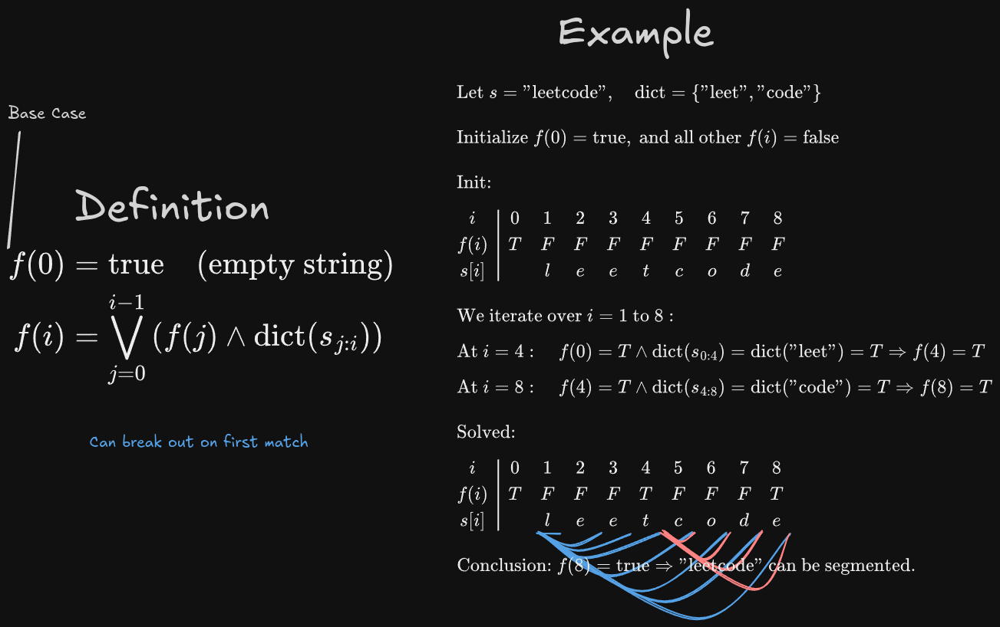

# [139. Word Break](https://leetcode.com/problems/word-break/)

- Decision Problem

## Solution 1 - Bottom Up Tabulation

- Keep table cache for each item if it built words with the dict or not
- Think of it as f(n) for real. F(len(s)) will have the answer
- Base case f(0) is True
- Search backwards in the inner loop to make it faster

