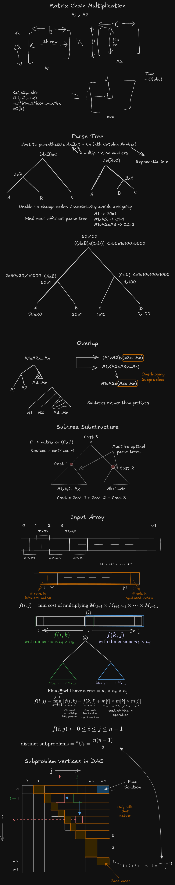

# [312. Burst Balloons](https://leetcode.com/problems/burst-balloons/)

## Matrix Chain Multiplication

| Property | Matrix | Normal | Example |
| ------------- | -------------- | -------------- | ---- |
| Associative | Yes | Yes | (M1xM2)xM3=M1x(M2xM3) |
| Commutative | No | Yes | M1xM2!=M2xM1 |

