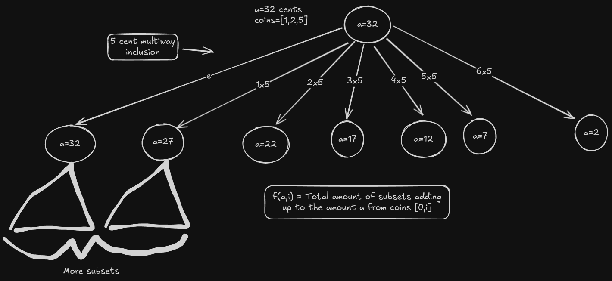

# [518. Coin Change II](https://leetcode.com/problems/coin-change-ii/)

- Counting Problem



## Solution 1 - O(n3)

```text
Counting Problem

f(a,i) = sum(f(a-c*coins[i],i-1))

amount=5, coins=[1,2,5]
│   0 1 2 3 4 5
│ 0 1 0 0 0 0 0
│ 1 1 1 1 1 1 1
│ 2 1 1 2 2 3 3
│ 5 1 1 2 2 3 4
```

## Solution 2 - O(n2)

```text
Space optimized

amount=5,coins=[1,2,5]
│ 1 1 2 2 3 4
```

## Solution 3 - O(n3)

```text
Final optimization - avoid coins > amount

amount=5,coins=[1,2,5]
│ 1 1 2 2 3 4
```
