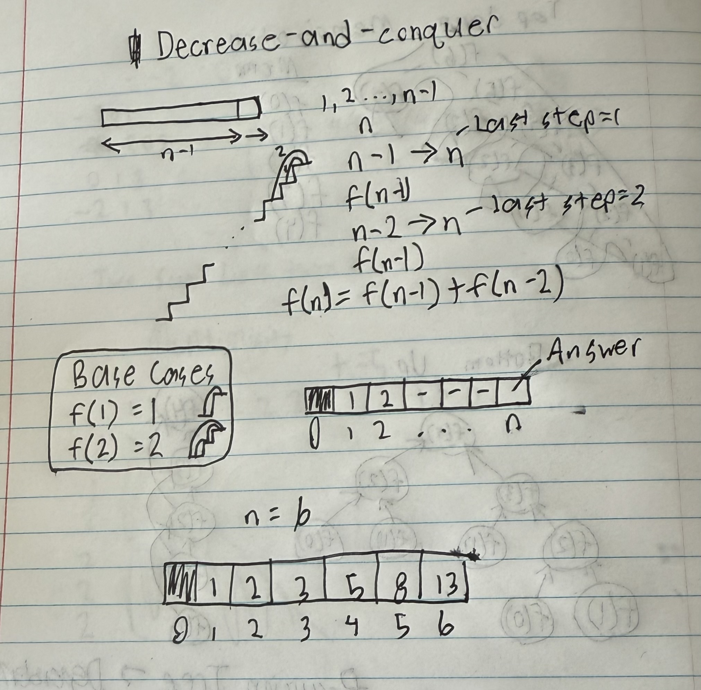

# [70 Climbing Stairs](https://leetcode.com/problems/climbing-stairs/)

## Solution 1 - Dynamic Programming

- Counting problem &rarr; Recurrence equation &rarr; Bottom-up implementation
- Max steps at a time is 2. How many ways to climb the stairs?



   ```text
   def f(n):
      if n==1: return 1
      if n==2: return 2
      table = array of size n+1
      for i in range [3,n]:
         table[i] = table[i-1]+table[i-2]
      return table[n]
   ```

- Can apply similar optimization

   ```text
   def f(n):
      if n==1: return 1
      if n==2: return 2
      a,b=1,2
      for i in range [3,n]:
         a,b=b,a+b
      return b
   ```
