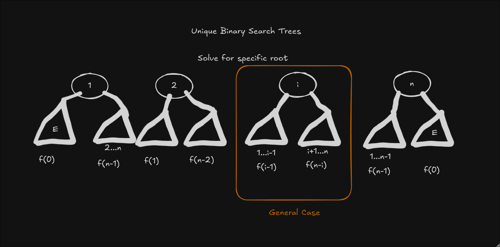

# [96. Unique Binary Search Trees](https://leetcode.com/problems/unique-binary-search-trees/)

## Solution 1 - O(n2)



```text
Counting Problem
Same as well formed parenthesis problem

f(n) = #structurally unique BSTs build out of n
       consecutive integers
f(n) = sum(f(i-1)*f(n-i))
f(n) = f(0)*f(n-1)+f(1)*f(n-2)+...+f(n-1)*f(0)

n=5
│ 1 1 2 5
```
